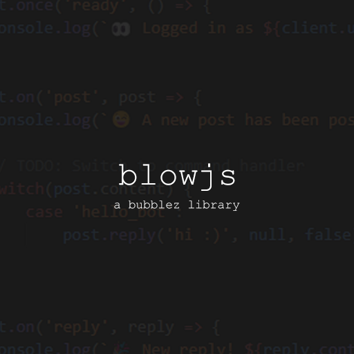

# ⚠ This project is no longer maintained due to Bubblez Next! ⚠
I will release an updated version specifically for Bubblez Next, as there are many API changes. As of right now, I do not want to waste my time on a project that will soon become abandoned anyways.

Thank you for using blowjs! 💖

<sup>All of the functions work - though logging in is still very buggy for reasons unbenounced to me. However, if you want to give it a try at fixing it then create a PR, here's what it does: it spams the API due to the User getter, so I can't make it object-oriented.</sup>

-------

<p align="center">
    
</p>

blowjs is a Bubblez.app library meant for ease of use and optimization, along with confirgurability

* Want to learn how to use blowjs? Visit the docs [here](/DOCS.md) (only accessible on GitHub).
* Having issues and need support? ~~Visit our Discord [here](https://discord.gg/czfj9DyY7F).~~ Discord deleted! Just make an issue in GitHub

## Example of blowjs
```js
import Client from './index.mjs';
const client = new Client();

import dotenv from 'dotenv';
dotenv.config();

console.log('👌 Loading up blowjs!');

client.once('ready', async() => {
    console.log(`👀 Logged in as ${client.user.username}`);
});

client.on('post', async post => {
    console.log(`😉 A new post has been posted with the content of "${post.content}"`);

    switch(post.content) {
        case 'hello blowjs':
            post.reply('hi :)', null, false);
            break;

        case 'whats the latest devlog?':
            const latestBlog = await client.blogs.getLatest();
            post.reply(latestBlog.content);
            break;
    }
});

client.once('close', code => {
    console.log(`🔒 Closed on code ${code}`);
});

client.login(process.env.TOKEN);
```

# Recent Updates
View all recent updates in the GitHub, I realize I will not update this section often at all

##### Bubblez Approval
###### [Bubblez.app](https://bubblez.app/library#blowjs) has approved blowjs
